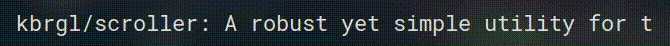

# Description


Scroller is a simple yet incredibly robust and powerful scrolling animator written in Python.

Its primary use case lies with window managers, GUIs and TUIs where screen real estate is limited and it is useful to truncate or animate the text to fully utilise available space. It is meant to be used as part of a chain of Unix pipes.

Scroller has been built with sane defaults and it is incredibly easy to get started. An example:

```sh
# xtitle is a command line utility that gets the title of the currently focused window from your desktop environment or window manager. The -s flag causes it to stream the window titles - whenever the active window changes, it outputs the new title
# lemonbar is a simple program for rendering a status bar / panel on your display - it is commonly used with window managers like i3 and bspwm
xtitle -s | scroller -o -n | lemonbar
```

Using it is literally that simple. The window manager use case is just an example - Scroller can be used anywhere.

# Installation
Scroller itself has no dependencies apart from Python 3. However, you must have Python's `setuptools` installed in order to use it.
```sh
git clone https://github.com/kbrgl/scroller.git
cd scroller
sudo pip install .
```

## Installing pip
Run `which pip` to check whether you have pip installed - if the command returns a path, you have pip.

If you do not have pip installed, you can Google "install python 3 pip <your linux distribution / operating system here>" for instructions on how to install it.

# Usage
```sh
usage: scroller [-h] [-i INTERVAL] [-m] [-s SEP] [-l LEN] [-c COUNT] [-r] [-o]
                [-p] [-v] [-a POSTFIX] [-b PREFIX]

A robust yet simple utility for animating scrolling text in the terminal.

optional arguments:
  -h, --help            show this help message and exit
  -i INTERVAL, --interval INTERVAL
                        specify scroll speed in seconds
  -m, --mutate          scroll the text in place
  -s SEP, --separator SEP
                        append a separator to input string before animating,
                        used as padding
  -l LEN, --length LEN  scroll text only if its length is greater than or
                        equal to this value
  -c COUNT, --count COUNT
                        specify number of characters to scroll
  -r, --reverse         scroll text in the opposite direction
  -o, --open            keep stdin open and reload on any new input
  -p, --persist         if using --open flag, do not exit after stdin is
                        closed
  -v, --version         print version and exit
  -a POSTFIX, --after POSTFIX
                        append a static postfix to the text
  -b PREFIX, --before PREFIX
                        prepend a static prefix to the text
```

# Examples
In several of the following examples, I use the -n flag which causes the text to be output on several lines. I've done this to make what is happening a little clearer.

## Count
The `-c 5` option specifies that 5 permutations should be made. In its absence, an infinite number of permutations would be made so the text would be scrolling indefinitely.
```sh
$ echo 'Gumby' | scroller -c 5
umby G
mby Gu
by Gum
y Gumb
 Gumby
```

## Listen for fresh input on stdin
The `-o` option means "Listen for incoming input. Whenever new input is received, update the current string with the new input." This option is useful if you are using Scroller to scroll text that is likely to change, such as the title of the active window, information about the currently playing song, etc.
```
$ xtitle -s | scroller -o
~/Code/scroller | nvim 
/Code/scroller | nvim $
Code/scroller | nvim $/
ode/scroller | nvim $/C
# now, I switch to another window. this causes xtitle to output a new line of text. scroller picks up this new line of text.
~ | fish 
 | fish ~
| fish ~ 
```
One thing to note is that if the input stream is closed, Scroller will also exit. This behaviour can be overriden with the `-p` flag.

When `-c` or `--count` is used with `-o`, then count specifies the maximum number of times __each string__ can be scrolled. If any of the strings is scrolled for longer than that, then Scroller exits.

## Truncation
The `-l 5` option means "if the text is less than 5 characters long then do not scroll it". This option is immensely useful if you want to make sure the text does not exceed a certain length -- sure, you could truncate it, but truncation may leave out important details.
```sh
$ echo 'John' | scroller -c 3 -l 5
John
John
John
```

## Separator
The `-s ' -- '` option means "after the entire string has been displayed, separate the end of the string and the start of string with ' -- '.
```sh
$ echo 'John' | scroller -c 3 -s ' -- '
ohn -- J
hn -- Jo
n -- Joh
```
By default, the separator is a single space. If the default separator was an empty string (''), the output would look like the following:
```
ohnJ
hnJo
nJoh
```

## Static prefix / postfix
You can use static prefixes and postfixes using the `-b` and `-a` flags (standing for 'before' and 'after')
```sh
$ echo 'text' | scroller -c 5 -b '... ' -a ' ...' -s ''
... extt ...
... xtte ...
... ttex ...
... text ...
... extt ...
```

# License
Scroller is open source software licensed under the terms of the MIT license.
